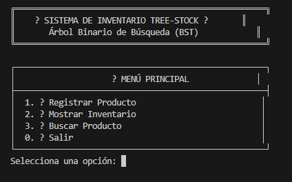
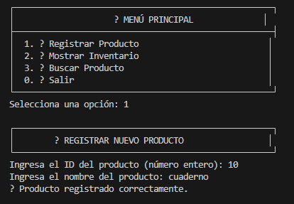
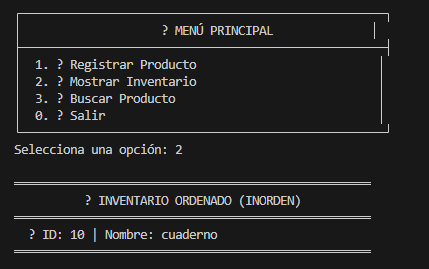
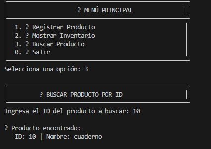

# 🌳 Tree-Stock: Sistema de Inventario con Árbol Binario de Búsqueda

## 📌 Objetivo

Desarrollar una aplicación de consola en Java que implemente un **Árbol Binario de Búsqueda** para gestionar un inventario de productos. El sistema permite registrar, buscar y listar productos de manera ordenada, aplicando conceptos de estructuras de datos, recursividad y manejo de referencias en árboles binarios.

---

## 📋 Descripción del Proyecto

**Tree-Stock** es un sistema de inventario desarrollado en Java que utiliza un **Árbol Binario de Búsqueda (BST)** como estructura principal para almacenar productos organizados por ID.

El programa permite:

- ✅ Registrar productos  
- ✅ Buscar productos por ID  
- ✅ Mostrar el inventario ordenado mediante recorrido inorden  
- ✅ Interactuar mediante un menú en consola  
- ✅ Validar entradas del usuario  

---

## 🏗️ Estructura del Proyecto

El proyecto está compuesto por las siguientes clases:

### 📦 Producto.java
Representa cada nodo del árbol binario.

**Atributos principales:**
- `id`: identificador único del producto  
- `nombre`: nombre del producto  
- `izquierdo`: referencia al hijo izquierdo  
- `derecho`: referencia al hijo derecho  

---

### 🌲 ArbolInventario.java
Contiene la lógica del árbol binario de búsqueda.

**Funciones principales:**
- Insertar productos  
- Buscar productos por ID  
- Mostrar productos ordenados (recorrido inorden)  
- Verificar si el inventario está vacío  

---

### 🖥️ Main.java
Contiene el menú interactivo del sistema.

**Opciones disponibles:**
1. Registrar producto  
2. Mostrar inventario  
3. Buscar producto  
0. Salir  

---

## 🚀 Cómo ejecutar

### Requisitos:
- Java JDK 8 o superior (recomendado: Eclipse Temurin)
- VS Code o cualquier editor de texto

### Pasos de ejecución:

**Opción 1: Desde VS Code**
1. Abre el proyecto en VS Code
2. Instala la extensión "Extension Pack for Java" (si no está instalada)
3. Navega a la carpeta `src/`
4. Abre el archivo `Main.java`
5. Presiona `Ctrl + F5` o haz clic en "Run" arriba del método `main()`

**Opción 2: Desde terminal (PowerShell/CMD)**
```bash
# Navega a la carpeta del proyecto
cd proyecto_final

# Compila todos los archivos Java
javac src/*.java

# Ejecuta la aplicación
java -cp src Main
```

**Opción 3: Compilar manualmente en VS Code**
```bash
# En la terminal integrada de VS Code
cd src
javac *.java
java Main
```

---

## 📸 Capturas de Pantalla de Ejecución

### Pantalla 1: Menú Principal



### Pantalla 2: Registrar Productos



### Pantalla 3: Mostrar Inventario (Recorrido Inorden)



### Pantalla 4: Buscar Producto



---

---

## 📊 Ejemplo de Árbol

Si insertamos en este orden: 50, 25, 75, 10, 30, 60, 100

El árbol resultante es:
```
        50
       /  \
      25   75
     / \   / \
    10 30 60 100
```

**Recorrido inorden**: 10, 25, 30, 50, 60, 75, 100 ✅

---

## 👨‍💻 Sustentación

Enlace al video de explicación del proyecto:

**Link del video:**  
https://drive.google.com/file/d/1t5l_Pp7A0Si9DVndzlXJavk01yNUq-uc/view?usp=sharing

---

## 📄 Autor

**Proyecto Final - Estructuras de Datos**  
Sistema de Inventario Tree-Stock  

**Nombre:** Yeison Villada Sánchez


---

**¡Gracias por usar Tree-Stock!** 🌳✨
